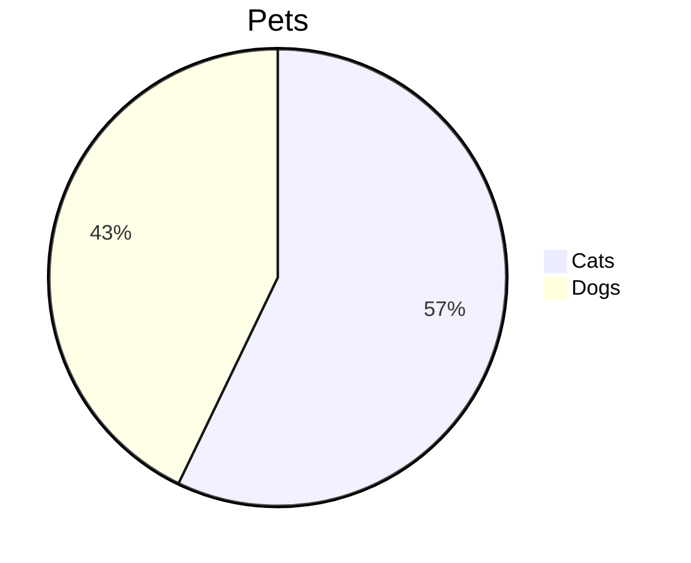
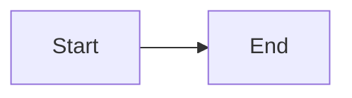
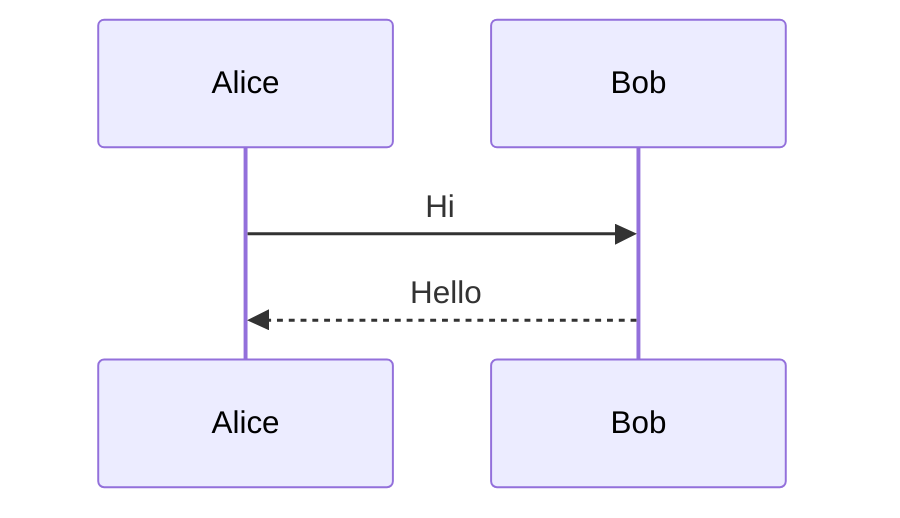

# Second Diagrams

## pie

```mermaid
pie
    title Pets
    "Cats" : 4
    "Dogs" : 3
```

## flowchart

```mermaid
flowchart LR
    A[Start] --> B[End]
```

## sequenceDiagram

```mermaid
sequenceDiagram
    Alice->>Bob: Hi
    Bob-->>Alice: Hello
```
